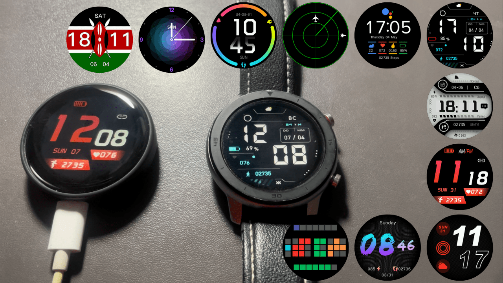

# ZSWatch LVGL Watchfaces

## Table of Contents

- [ZSWatch LVGL Watchfaces](#zswatch-lvgl-watchfaces)
  - [Table of Contents](#table-of-contents)
  - [About](#about)
  - [Video](#video)
  - [Watchfaces](#watchfaces)
      - [Preview](#preview)
  - [Preparation (Linux)](#preparation-linux)
  - [Usage](#usage)
  - [Maintainer](#maintainer)

## About

This project renders pre-built binary watchfaces on ESP32 using LVGL. A Kotlin script is used to transform the binary watchfaces into LVGL code, which is then compiled for the [ZSWatch](https://github.com/jakkra/ZSWatch).

> NOTE: This script only support ZSWatch v4 and above!

Forked from [esp32-lvgl-watchface](https://github.com/fbiego/esp32-lvgl-watchface).

## Video

[`Watchfaces demo`](https://youtu.be/lvRsTp9v6_k)

## Watchfaces

Watchfaces can be obtained from [watch-face-wearfit](https://github.com/fbiego/watch-face-wearfit) or [Chronos Dials](https://chronos.ke/dials). Since the ZSWatch uses a 240x240 screen, watchfaces of the same resolution are recommended.

 

#### Preview

| | | |
| -- | -- | -- |
|  |  |  |
|  |  |  |
|  |  |  |
|  |  |  |

## Preparation (Linux)

- Install the Java JDK by running `sudo apt-get install openjdk-11-jdk` 
- Install Kotlin by using `sudo apt-get install kotlin`
- Run `export ZSWATCH_ROOT=<ZSWatch-Root>` and replace `ZSWatch-Root` with the root directory of your [ZSWatch](https://github.com/jakkra/ZSWatch) project

## Usage

- Run `generate.sh` and pass in the URL of the target watchface (i. e. `https://github.com/fbiego/watch-face-wearfit/raw/main/dials/HW21/107_2_dial.bin`)

```sh
generate.sh https://github.com/fbiego/watch-face-wearfit/raw/main/dials/HW21/107_2_dial.bin
```

- If the script is executed without an error you can compile the ZSWatch firmware
- Enjoy the new watchface


## Maintainer

- [Daniel Kampert](mailto:daniel.kameprt@kampis-elektroecke.de)
